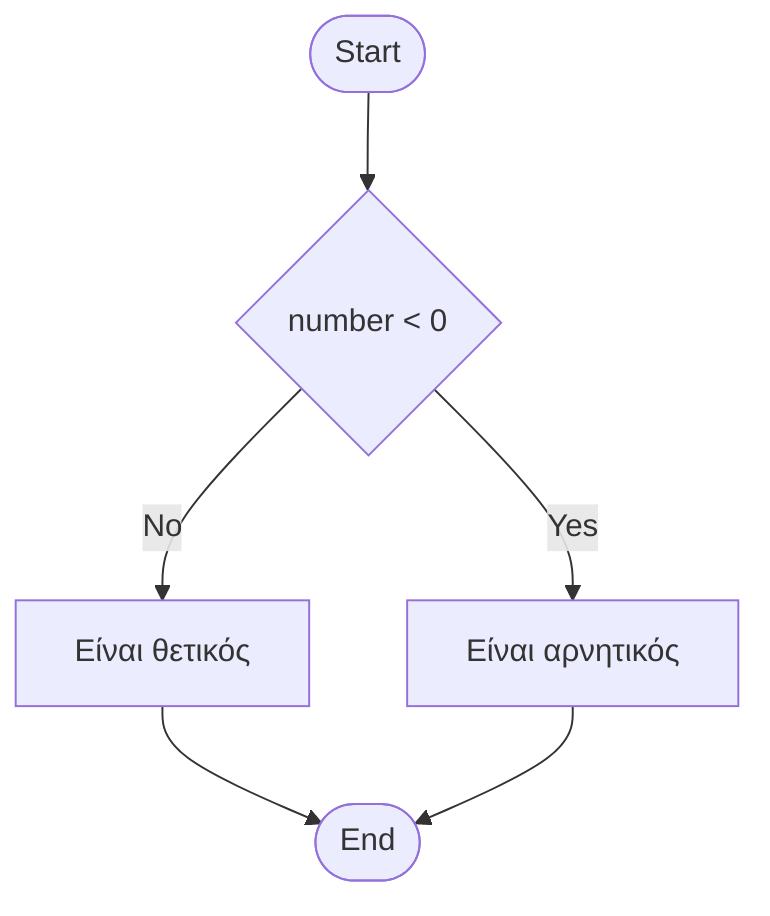
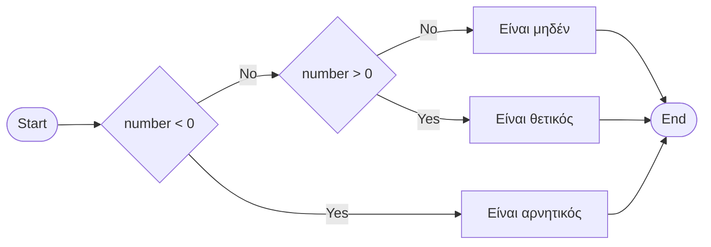
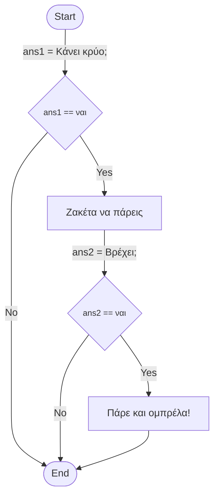

# Κεφάλαιο 2: Δομές Ελέγχου Ροής στην Python

## 2.1 Εισαγωγή στις Δομές Ελέγχου

Οι δομές ελέγχου ροής (control flow statements) είναι θεμελιώδη στοιχεία του προγραμματισμού που μας επιτρέπουν να ελέγχουμε τη ροή εκτέλεσης του προγράμματός μας.

## 2.2 Δομές Επιλογής

### 2.2.1 Απλή Δομή if

Η απλή δομή if εκτελεί ένα block κώδικα μόνο όταν η συνθήκη είναι αληθής (True).

```python
if condition:
    # εντολές που θα εκτελεστούν
    # αν η συνθήκη είναι True
```

### 2.2.2 Δομή if-else

Η δομή if-else μας επιτρέπει να εκτελέσουμε διαφορετικό κώδικα ανάλογα με το αν η συνθήκη είναι αληθής ή ψευδής.

```python
if condition:
    # εντολές για True
else:
    # εντολές για False
```


### 2.2.3 Δομή if-elif-else

Η πλήρης δομή if-elif-else χρησιμοποιείται όταν έχουμε πολλαπλές συνθήκες προς έλεγχο.


```python
if condition_1:
    # εντολές για συνθήκη_1
elif condition_2:
    # εντολές για συνθήκη_2
else:
    # εντολές αν καμία συνθήκη δεν είναι True
```

Το παρακάτω διάγραμμα δείχνει πώς λειτουργεί η δομή if-elif-else. Η ροή του προγράμματος ξεκινάει από δεξιά και ακολουθεί τα βέλη ανάλογα με το αποτέλεσμα κάθε συνθήκης.



## 2.3 Παραδείγματα από την Καθημερινή Ζωή

### Παράδειγμα 1: Σύστημα Ελέγχου Θερμοκρασίας Δωματίου

```python
# Αρχικοποίηση μεταβλητών
current_temperature = 28
"""
Ελέγχει τη θερμοκρασία δωματίου και προτείνει ενέργειες
για τη βελτιστοποίηση της θερμικής άνεσης.

"""
ideal_temperature = 22  # Ιδανική θερμοκρασία δωματίου

if current_temperature < 18:
    print("Η θερμοκρασία είναι χαμηλή!")
    print(f"Προτείνεται ενεργοποίηση θέρμανσης στους {ideal_temperature}°C")
    action = "θέρμανση"
elif current_temperature > 26:
    print("Η θερμοκρασία είναι υψηλή!")
    print(f"Προτείνεται ενεργοποίηση κλιματισμού στους {ideal_temperature}°C")
    action = "ψύξη"
else:
    print("Η θερμοκρασία είναι ιδανική!")
    action = "καμία_ενέργεια"
print(action)
```

### Παράδειγμα 2: Υπολογισμός Έκπτωσης Καταστήματος

```python
# Αρχικοποίηση μεταβλητών
amount = 150
is_member = True
"""
Υπολογίζει την έκπτωση βάσει του ποσού αγοράς και της
ιδιότητας μέλους του πελάτη.
"""
if amount > 200:
    if is_member:
        discount = 25  # 25% έκπτωση για μέλη με αγορές άνω των 200€
    else:
        discount = 20  # 20% έκπτωση για μη μέλη με αγορές άνω των 200€
elif amount > 100:
    if is_member:
        discount = 15  # 15% έκπτωση για μέλη με αγορές άνω των 100€
    else:
        discount = 10  # 10% έκπτωση για μη μέλη με αγορές άνω των 100€
else:
    if is_member:
        discount = 5   # 5% έκπτωση για μέλη
    else:
        discount = 0   # Καμία έκπτωση για μη μέλη

discount_amount = amount * (discount / 100)
final_amount = amount - discount_amount

print(f"Αρχικό ποσό: {amount}€")
print(f"Ποσοστό έκπτωσης: {discount}%")
print(f"Τελικό ποσό: {final_amount}€")
```

## 2.4 Σημαντικές Παρατηρήσεις

1. Η εσοχή (indentation) είναι υποχρεωτική στην Python και καθορίζει τα blocks κώδικα
2. Μπορούμε να έχουμε όσα elif θέλουμε σε μια δομή ελέγχου
3. Το else είναι προαιρετικό
4. Μπορούμε να έχουμε εμφωλευμένες δομές ελέγχου (nested if statements)

## 2.5 Εμφωλευμένα if - Nested if

Τα παραδείγματα που δόθηκαν παραπάνω είναι οι βασικές γνώσεις που χρειάζεται κάποιος για την κατανόηση και την χρήση του ελέγχου ροής ενός προγράμματος.
Ωστόσο, ο πραγματικός κόσμος περιέχει πιο περίπλοκες διακλαδώσεις στην ακολουθία ενεργειών.
Δεν μας απαγορεύει κανένας να ορίσουμε σε ένα block εντολών του `#!python if` ένα νέο **if-else** block.

Όταν ένα **if-else** block περικλείεται από ένα άλλο, το εσωτερικό block καλείται _εμφωλευμένο αν_ (**nested-if**).

!!! example "Παράδειγμα Nested if"

    ```py
    number = 4
    ans1 = input("Κάνει κρύο; ")
    if ans1 == "ναι":
        print("Ζακέτα να πάρεις")
        ans2 = input("Βρέχει; ")
        if ans2 == "ναι":
            print("Πάρε και ομπρέλα!")
    ```

### Διάγραμμα Ροής Nested if



## 2.6 Λογικοί τελεστές

Μπορούμε

```py title="Εύρεση μεγαλύτερου"

number1 = int(input("Δώσε 1ο αριθμό: "))
number2 = int(input("Δώσε 2ο αριθμό: "))
number3 = int(input("Δώσε 3ο αριθμό: "))

if number1 > number2 and number1 > number3:
    greatest = number1

elif number2 > number3:
    greatest = number2

else:
    greatest = number3

print(f"Ο μεγαλύτερος αριθμός είναι ο {greatest}.")
```

??? info "Πίνακας Λογικού AND & OR"

    |   x   |   y   | Λογικό AND | Λογικό OR |
    | :---: | :---: | :--------: | :-------: |
    | False | False |   False    |   False   |
    | False | True  |   False    |   True    |
    | True  | False |   False    |   True    |
    | True  | True  |    True    |   True    |

??? info "Πίνακας Λογικού NOT"

    |   x   | Λογικό NOT |
    | :---: | :--------: |
    | False |    True    |
    | True  |   False    |

## 2.7 Σχεσιακοί Τελεστές

| Τελεστής |    Περιγραφή     | Παράδειγμα  | Αποτέλεσμα |
| :------: | :--------------: | :---------: | :--------: |
|    ==    |       Ίσο        |   4 == 3    |   False    |
|    >=    | Μεγαλύτερο ή ίσο |   1 >= -1   |    True    |
|    >     |    Μεγαλύτερο    |  -8.2 > 2   |   False    |
|    <=    | Μικρότερο ή ίσο  | 100 <= 32.1 |   False    |
|    <     |    Μικρότερο     |   4 < 72    |    True    |
|    !=    |     Διάφορο      |   2 != 5    |    True    |

## 2.8 Λογικοί Τελεστές

| Τελεστής | Περιγραφή  |  Παράδειγμα   | Αποτέλεσμα |
| :------: | :--------: | :-----------: | :--------: |
|   and    | Λογικό ΚΑΙ | True and True |    True    |
|    or    |  Λογικό Ή  | True or False |    True    |
|   not    | Λογικό ΟΧΙ |   not False   |    True    |

## 2.9 Καλές Πρακτικές

1. Να προσθέτετε σχόλια για να εξηγήσετε πολύπλοκη λογική
2. Αποφεύγετε τις πολλαπλές εμφωλευμένες δομές ελέγχου
3. Χρησιμοποιείτε κατάλληλη εσοχή για καλύτερη αναγνωσιμότητα
4. Ελέγχετε όλες τις πιθανές περιπτώσεις ώστε το πρόγραμμα σας να μην έχει ανεπιθύμιτη συμπεριφορά
