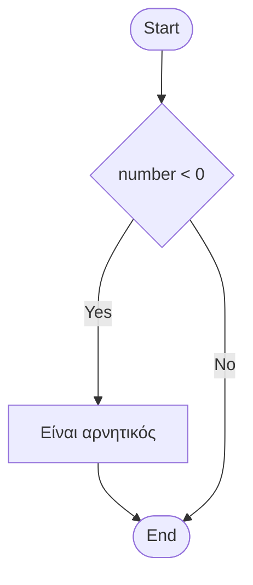
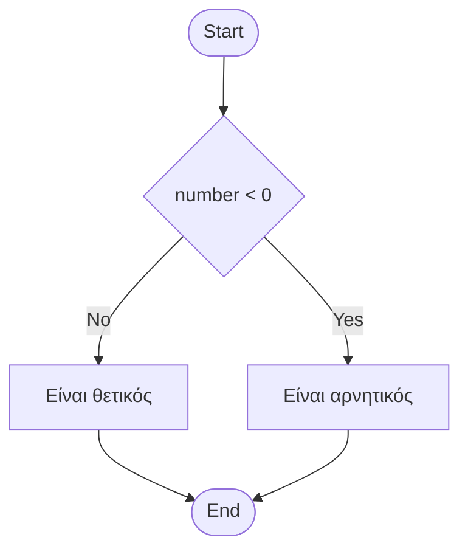
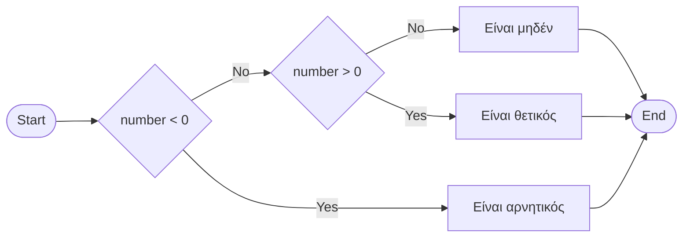
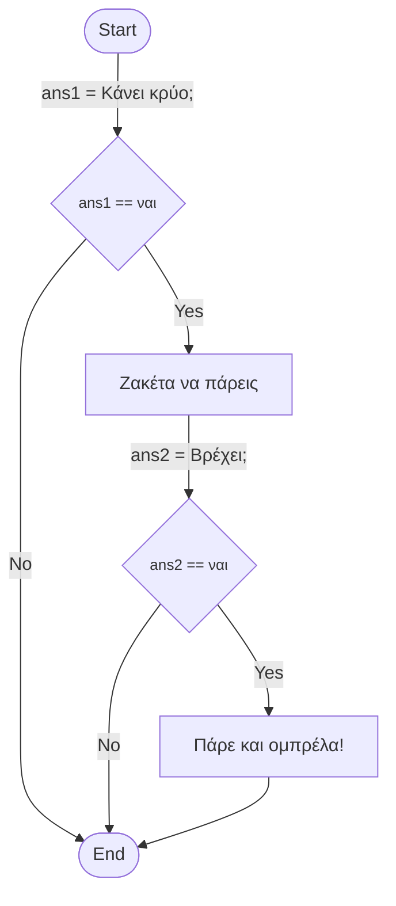

# Δομές Ελέγχου

## ❓Γιατί δομές ελέγχου;

Στο πρώτο κεφάλαιο ([Εισαγωγή στην Python](./01%20-%20Introduction%20to%20Python.md)) είδαμε προγράμματα που εκτελούνται σειριακά. Ωστόσο, εάν θέλουμε να λύσουμε μια δευτεροβάθμια εξίσωση ανάλογα με την τιμή της διακρίνουσας ακολουθούμε στην συνέχεια άλλες ενέργειες. Έτσι, και στον προγραμματισμό είναι απαραίτητη η δημιουργία διαφορετικών τμημάτων κώδικα που τρέχουν για διαφορετικές περιπτώσεις.

## Λογικές Παραστάσεις

Λογικές παραστάσεις (**boolean expressions**) καλούμε τις παραστάσεις, που είτε είναι αληθείς (**True**), είτε ψευδείς (**False**).

```py title="Σύγκριση Ισότητας"
>>> 2==2
True
>>> 2==3
False
```

### Σχεσιακοί Τελεστές

| Τελεστής |    Περιγραφή     | Παράδειγμα  | Αποτέλεσμα |
| :------: | :--------------: | :---------: | :--------: |
|    ==    |       Ίσο        |   4 == 3    |   False    |
|    >=    | Μεγαλύτερο ή ίσο |   1 >= -1   |    True    |
|    >     |    Μεγαλύτερο    |  -8.2 > 2   |   False    |
|    <=    | Μικρότερο ή ίσο  | 100 <= 32.1 |   False    |
|    <     |    Μικρότερο     |   4 < 72    |    True    |
|    !=    |     Διάφορο      |   2 != 5    |    True    |

<!-- ? TODO ??? example Παράδειγμα Σχεσιακοί τελεστές -->

<!-- TODO #### / !!! danger Σχεσιακοί τελεστές και floats  -->

<!-- TODO #### / !!! tip Σχεσιακοί τελεστές και strings  -->

### Λογικοί Τελεστές

| Τελεστής | Περιγραφή  |  Παράδειγμα   | Αποτέλεσμα |
| :------: | :--------: | :-----------: | :--------: |
|   and    | Λογικό ΚΑΙ | True and True |    True    |
|    or    |  Λογικό Ή  | True or False |    True    |
|   not    | Λογικό ΟΧΙ |   not False   |    True    |

<!-- ? TODO ??? example Παράδειγμα Λογικοί τελεστές -->

<!-- ? ### Τελεστές Καταχώρησης -->

<!-- ? TODO ### Τελεστές Καταχώρησης -->

<!-- ? TODO ??? example Παράδειγμα Τελεστές Καταχώρησης -->
<!-- ! TODO ??? example Παράδειγμα Λογικοί & Σχεσιακοί τελεστές -->
<!-- ! TODO ###  Συγκρίσεις με strings -->
<!-- ! TODO ###  Συγκρίσεις με - Παρουσίαση λειτουργίας in για strings μονο -->

### Bitwise Τελεστές

| Τελεστής | Περιγραφή  | Παράδειγμα | Αποτέλεσμα |
| :------: | :--------: | :--------: | :--------: |
|    &     | Λογικό AND |   10 & 5   |     0      |
|    \|    | Λογικό OR  |   x \| y   |     15     |
|    ~     | Λογικό NOT |     ~5     |     -6     |
|    ^     | Λογικό XOR |   10 ^ 9   |     3      |

??? note "Επεξήγηση"

    Οι πράξεις μεταξύ αριθμών με τους τελεστές Bitwise γίνεται σε κάθε bit πληροφορίας ξεχωριστά.
    Στο παράδειγμα για το λογικό **AND**, η τιμή 10 στο δυαδικό σύστημα είναι `1010` και η τιμή 5 είναι `0101`.
    Οπότε έχουμε:

    $$ AND $$

    $$
    \begin{matrix}
    1010 \\
    0101 \\
    \above{2pt} \\
    0000
    \end{matrix}
    $$

!!! danger "Σύγχυση μεταξύ τελεστών"

    Είναι σύνηθες, ειδικά στην αρχή, να μπερδεύουμε τα εξής:

    - Ο τελεστής ισότητας είναι ο **==** και όχι **=** που είναι τελεστής ανάθεσης.
    - Οι τελεστές *μεγαλύτερο ή ίσο* και *μικρότερο ή ίσο* γράφονται αυστηρά **<=**, **>=** και όχι =<, =>.

???+ bug "Αποφυγή λαθών"

    Όταν χρησιμοποιούμε πολλαπλές λογικές παραστάσεις είναι καλή πρακτική να χρησιμοποιούμε παρενθέσεις **( )**.

    - Για την αποφυγή προγραμματιστικών λαθών
    - Καλύτερη κατανόηση του κώδικα μετέπειτα ή από άλλους

## Η εντολή if

Με μια δομή ελέγχου μπορούμε να κατευθύνουμε την ροή του προγράμματος μας όπως εμείς θέλουμε. Επομένως, με την εντολή if μπορούμε να εκτελούμε διαφορετικά block εντολών ανάλογα με τις συνθήκες που θέτουμε.

Μια τέτοια δομή στην Python ορίζεται ως εξής:

```py title="Δομή if"
if συνθήκη:
    block_εντολών   # True block
```

Ο ορισμός γίνεται με λέξη-κλειδί `#!python if` (αν) και ακολουθεί μια συνθήκη, που είναι είτε αληθής είτε ψευδής. Στην συνέχεια, ακολουθεί μια άνω και κάτω τελεία `:` και από κάτω γράφουμε τις εντολές που θέλουμε να εκτελεστούν εάν ισχύει η συνθήκη. Σημαντικό είναι να προσέξουμε να τοποθετούμε τις εντολές με το σωστό κενό (tab).

<!-- indentation rule -->

!!! example "Παράδειγμα if"

    ```py
    number = 4
    if number < 0:
        print("Είναι αρνητικός")
    ```

### Διάγραμμα Ροής if

Η υλοποίηση του παραπάνω παραδείγματος σε ένα διάγραμμα ροής είναι η εξής:



## Η εντολή else

<!-- ! TODO REWRITE else -->

Η εντολή `#!python else` συμπληρώνει την προηγούμενη εντολή `#!python if`. Στην περίπτωση που δεν ισχύει η συνθήκη τότε το πρόγραμμα θα εκτελέσει τις εντολές που βρίσκονται
μετά το `#!python else`.

!!! example "Παράδειγμα else"

    ```py
    number = 4
    if number < 0:
        print("Είναι αρνητικός")
    else:
        print("Είναι θετικός")
    ```

### Διάγραμμα Ροής else



!!! warning "Λογικό λάθος"

    Εάν παρατηρήσουμε καλύτερα το παραπάνω πρόγραμμα έχει λογικό λάθος. Στην περίπτωση που η μεταβλήτη θα ήταν `0` η συνθήκη δεν θα ίσχυε και το πρόγραμμα θα εμφάνιζε
    `Είναι θετικός` αφού θα εκτελούνταν οι εντολές στο `#!python else`!

## Η εντολή elif

Οι εντολές `#!python if` και `#!python else` είναι χρήσιμες αλλά σε πολλές περιπτώσεις χρειάζεται να ελέγξουμε περισσότερες περιπτώσεις των μεταβλητών μας.
Θα μπορούσαμε να το πετύχουμε αυτό χρησιμοποιώντας πολλά `#!python if`, αλλά ευτυχώς μπορούμε να συμπεριλάβουμε πολλές περιπτώσεις σε έναν έλεγχο χρησιμοποιώντας το
`#!python elif`. Η σύνταξη του είναι παρόμοια με αυτή του if, αφού είναι απαραίτητο να δώσουμε μια συνθήκη στο πρόγραμμα μας.

!!! example "Παράδειγμα elif"

    ```py
    number = 0
    if number < 0:
        print("Είναι αρνητικός")
    elif number > 0:
        print("Είναι θετικός")
    else:
        print("Είναι μηδέν")
    ```

### Διάγραμμα Ροής elif

Η υλοποίηση του παραπάνω παραδείγματος σε ένα διάγραμμα ροής είναι η εξής:



## Εμφωλευμένα if - Nested if

Τα παραδείγματα που δόθηκαν παραπάνω είναι οι βασικές γνώσεις που χρειάζεται κάποιος για την κατανόηση και την χρήση του ελέγχου ροής ενός προγράμματος.
Ωστόσο, ο πραγματικός κόσμος περιέχει πιο περίπλοκες διακλαδώσεις στην ακολουθία ενεργειών.
Δεν μας απαγορεύει κανένας να ορίσουμε σε ένα block εντολών του `#!python if` ένα νέο **if-else** block.

Όταν ένα **if-else** block περικλείεται από ένα άλλο, το εσωτερικό block καλείται _εμφωλευμένο αν_ (**nested-if**).

!!! example "Παράδειγμα Nested if"

    ```py
    number = 4
    ans1 = input("Κάνει κρύο; ")
    if ans1 == "ναι":
        print("Ζακέτα να πάρεις")
        ans2 = input("Βρέχει; ")
        if ans2 == "ναι":
            print("Πάρε και ομπρέλα!")
    ```

### Διάγραμμα Ροής Nested if



## Λογικοί τελεστές

Μπορούμε

```py title="Εύρεση μεγαλύτερου"

number1 = int(input("Δώσε 1ο αριθμό: "))
number2 = int(input("Δώσε 2ο αριθμό: "))
number3 = int(input("Δώσε 3ο αριθμό: "))

if number1 > number2 and number1 > number3:
    greatest = number1

elif number2 > number3:
    greatest = number2

else:
    greatest = number3

print(f"Ο μεγαλύτερος αριθμός είναι ο {greatest}.")
```

??? info "Πίνακας Λογικού AND & OR"

    |   x   |   y   | Λογικό AND | Λογικό OR |
    | :---: | :---: | :--------: | :-------: |
    | False | False |   False    |   False   |
    | False | True  |   False    |   True    |
    | True  | False |   False    |   True    |
    | True  | True  |    True    |   True    |

??? info "Πίνακας Λογικού NOT"

    |   x   | Λογικό NOT |
    | :---: | :--------: |
    | False |    True    |
    | True  |   False    |

## 📝Ασκήσεις

### Άσκηση 1η

Να φτιάξετε ένα πρόγραμμα το οποίο θα δέχεται ως είσοδο την θερμοκρασία σε βαθμούς κελσίου.
Θα ρωτάει τον χρήστη εάν θέλει να τους μετατρέψει σε Fahrenheit (ναι/οχι).

**Περιπτώσεις**

- Στην "ναι" τυπώνεται το μήνυμα "23 βαθμοί Κελσίου είναι 73.4 Fahrenheit".
- Στην "οχι" τυπώνεται το μήνυμα "Αντίο".

Τύπος για την μετατροπή:

$
F = { 1.8C +32}
$

### Άσκηση 2η

Να φτιάξετε ένα πρόγραμμα που να προσομοιώνει την λειτουργία ενός ATM τράπεζας με τις παρακάτω λειτουργίες.

- Ο χρήστης να διαλέγει ανάμεσα στις λειτουργίες "Κατάθεση" και "Ανάληψη".
- Να εμφανίζει το νέο υπόλοιπο σε περίπτωση κατάθεσης.
- Να εμφανίζει το υπόλοιπο σε περίπτωση ανάληψης.
- Να εμφανίζει μήνυμα αποτυχίας συναλλαγής, εάν τα χρήματα για ανάληψη δεν φτάνουν. (Προφανώς να μην εκτελείται η πράξη της ανάληψης).

### Άσκηση 3η

Δίνεται η παρακάτω λίστα που αντιπροσωπεύει τους φοιτητές σε μία τάξη εργαστηρίου του μαθήματος `Εισαγωγή στο Προγραμματισμό`:

```py
students = ["Χρηστος", "Μακης", "Μαρια", "Αντρεας", "Νικη"]

```

Να φτιάξετε ένα πρόγραμμα που ρωτάει τον χρήστη το όνομα ενός φοιτητή και ελέγχει εάν μέσα στους μαθητές αυτής της τάξης.
Εάν είναι να εμφανίζεται κατάλληλο μήνυμα.

<!-- ???+ hint "Hint" -->
